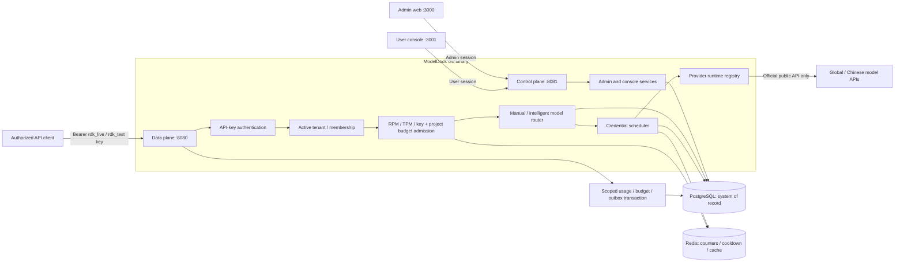

# Architecture

ModelDock V3 is a modular monolith delivered as one Go binary. The binary opens
two listeners: the data-plane gateway on `:8080` and the control-plane API on
`:8081`. This keeps deployment simple while maintaining strict package, route,
authentication, and network boundaries.

## System context



## Control plane

The control plane owns configuration and human workflows:

- login and role-based access (`SUPER_ADMIN`, `ADMIN`, `USER`);
- provider and authorized credential management;
- credential groups, tags, routes, model metadata, pricing versions, and
  intelligent routing rules;
- Marketplace listings, versioned release reviews/gates, payout readiness,
  lifecycle events, teams, wallets, transactions, and billing usage records;
- organizations, projects, memberships, and explicit project route grants;
- RelayDock API-key issuance, display-once secret delivery, versioned grace
  rotation, revocation, and quotas;
- project budgets, usage exports, signed Webhooks, health operations, request
  logs, alerts, and audit events.

Control-plane credentials never cross into the browser in plaintext. Provider
secrets are accepted over a protected administrator connection, encrypted
before persistence, and represented later only by `has_secret` and
`secret_last4`.

## Data plane

The data plane is deliberately narrow and latency-sensitive:

1. Assign or validate a client request ID.
2. Authenticate the RelayDock API-key version by constant-time HMAC comparison
   and validate the logical key, user, organization, project, and membership.
3. Resolve an exact project route or score eligible routes by exact price and
   platform-measured Provider quality/latency; then enforce the key allowlist,
   RPM/TPM, quotas, budget, and wallet. Provider/supplier declarations never
   become ranking inputs.
4. For a supplier-linked Provider, require a foundation-gated canary or a fully
   approved Marketplace release; repeat this condition before dispatch.
5. Merge project required/excluded credential tags with the route constraints.
6. Acquire a scheduler lease for one eligible authorized credential.
7. Decrypt the credential only for the in-memory upstream request.
8. Forward through the selected provider adapter; stream bytes/events incrementally when
   requested.
9. Before dispatch, atomically reserve the maximum exact-decimal customer charge
   in the immutable double-entry funding ledger. Primary and safe fallback
   attempts share this logical funding operation.
10. Release concurrency, settle actual or reproducibly estimated usage, release
   unused reservation, and transactionally persist the scoped request, usage,
   budget, billing projection, and matching Webhook outbox rows.

The gateway does not expose control-plane endpoints, provider credential IDs,
encrypted secret material, or upstream authorization headers.

## Provider adapter

The adapter contract separates provider-specific concerns from routing:

```go
type Provider interface {
    ListModels(ctx context.Context, credential Credential) ([]Model, error)
    CreateResponse(ctx context.Context, credential Credential, body io.Reader) (*http.Response, error)
    CreateChatCompletion(ctx context.Context, credential Credential, body io.Reader) (*http.Response, error)
    CreateEmbedding(ctx context.Context, credential Credential, body io.Reader) (*http.Response, error)
    HealthCheck(ctx context.Context, credential Credential) error
}
```

V3 resolves `provider_type` through a concurrency-safe runtime registry. OpenAI,
Anthropic, Gemini, and DeepSeek have distinct adapter types; Qwen, Kimi, GLM,
and OpenRouter use their official OpenAI-compatible surfaces. Provider-specific
headers, errors, and request IDs stay behind the adapter boundary.

## Credential scheduler

Commercial eligibility precedes scheduler health. See [Provider commercial governance](provider-governance.md). A healthy credential cannot make a pending, region-prohibited, over-budget, below-margin, or killed Provider eligible. The dispatch transaction rechecks the kill switch before recording an upstream attempt.

Only credentials that are enabled, healthy enough for admission, not cooling
down, members of the resolved group, and below their concurrency ceiling are
eligible. Selection is deterministic and explainable:

1. highest numeric effective priority tier wins;
2. within a tier, configured weight increases share;
3. active concurrency, recent error penalty, and latency may lower the score;
4. ties are stable or randomized only within the same documented score band.

The selection result records a redacted explanation such as health, cooldown,
active requests, configured priority/weight, and policy name. Redis performs
atomic concurrency acquisition and release. PostgreSQL remains authoritative;
Redis loss may temporarily reduce availability but cannot invent credentials.

## Request lifecycle

```mermaid
sequenceDiagram
    participant C as Authorized client
    participant G as Gateway
    participant R as Redis
    participant P as PostgreSQL
    participant S as Scheduler
    participant O as OpenAI adapter
    participant U as Usage collector

    C->>G: POST /v1/responses (RelayDock API key)
    G->>P: Verify key prefix/hash and policy
    G->>R: Admit RPM/TPM and quota reservation
    G->>P: Resolve model alias and credential group
    G->>S: Select eligible authorized credential
    S->>R: Atomic concurrency acquire
    S-->>G: Credential lease and reason
    G->>O: Official API request with decrypted secret
    O-->>G: Headers and response/SSE stream
    G-->>C: RelayDock request ID and response/SSE stream
    G->>S: Release lease; classify outcome
    S->>R: Release concurrency / set cooldown if applicable
    G->>U: Redacted usage and timing event
    U->>P: Request log and aggregate update
```

### V2.0 tenant and event gates

V2.0 performs authoritative project checks before route resolution: the API-key
version, logical key, user, organization, project, and required membership must
all be active. The requested alias must be an enabled project route grant and
then pass the key allowlist. Active project budgets are evaluated before
scheduling, and required/excluded credential tags are merged into the scheduler
constraints. A rejected grant, budget, or tag constraint produces no upstream
request.

Removing a project route is a soft-delete boundary: active catalogs and the
Gateway exclude the grant immediately, while request and usage ledgers retain
their route reference. Re-granting the same alias restores the existing row.

After a dispatched request, the project-scoped request log, daily/hourly usage,
budget ledger entry, and matching Webhook outbox rows are committed in the same
PostgreSQL transaction. Webhook workers claim rows with leases and compare-and-
set completion tokens; retryable failures back off and eventually become
`DEAD`. This is at-least-once delivery, so receivers must deduplicate by event
or delivery ID. See [v2.md](v2.md) for the exact envelope and acceptance matrix.

## Streaming behavior

- The gateway forwards SSE as it arrives and flushes each event/chunk.
- Client cancellation cancels the upstream request context.
- Time to first byte and total latency are measured separately.
- Once response bytes have been sent, RelayDock never switches credentials or
  replays the request.
- Unknown additive event types are passed through where safe; the proxy does
  not require a closed event enum to remain functional.
- Usage is taken from the terminal upstream object/event when present.

## Usage pipeline

The request path emits a compact internal event containing IDs, selected route,
status, token counts, estimated cost, latency, time to first byte, and scheduler
reason. It omits request/response content by default. PostgreSQL stores raw
request metadata and daily/hourly aggregates; dashboards read aggregates for
long ranges instead of repeatedly scanning the full request log.

`estimated_cost` remains a compatibility estimate. Commercial settlement uses
an immutable resolved `model_price_version`, then writes a
`usage_price_snapshot` containing provider cost, retail price, exchange rate,
promotion, tax, final due, and platform margin. The wallet charge is derived
only from `final_user_amount`, never from `estimated_cost`. See
[pricing.md](pricing.md).

## Secret management

- Provider secrets: AES-256-GCM with a fresh random nonce and authenticated
  metadata; master key supplied as `RELAYDOCK_MASTER_KEY`.
- RelayDock API keys: random high-entropy values shown once; only prefix and
  HMAC-SHA-256 digest are stored.
- Login passwords: adaptive password hashing; never reversible encryption.
- Login JWT/session secret: supplied separately as `RELAYDOCK_JWT_SECRET`.
- Decrypted provider secrets exist only for the duration of an upstream call
  and are never returned by read APIs.

## Failure handling

| Signal | State/action | Retry rule |
| --- | --- | --- |
| Upstream `401` / `403` credential failure | `AUTH_FAILED`; remove from scheduling; alert | Never retry with that credential |
| Upstream `429` | `RATE_LIMITED`/`COOLDOWN`; honor reset hint; alert on high rate | A later, independently admitted request may select another eligible credential |
| Connect failure before any upstream response | Record transient failure and return `502` | V2.0 does not replay the same request; a later request may select another eligible credential |
| `5xx` before response bytes | Error penalty and health signal | V2.0 returns the upstream response without same-request replay |
| Failure after streaming begins | Preserve partial stream semantics and close | Never replay or switch credential |
| Redis unavailable | Fail closed for distributed limits/scheduler acquisition | Recover when Redis returns |
| PostgreSQL unavailable | Readiness fails; no configuration mutations | Do not use stale secrets as authority |
| Platform quality circuit open | Stop new Provider attempts with generic `503`; retain SLA/audit evidence | Half-open only after timer or audited reset; close only after measured recovery |
| Marketplace review missing/revoked | Exclude supplier-backed Provider before routing and at dispatch | New versioned review; no declaration override |
| Emergency Marketplace cutover | Disable Provider, open kill switch, suspend link/listing | Reviewed `RESUME` only after incident and release evidence remain valid |

## Deployment topology

Docker Compose runs PostgreSQL, Redis, the single RelayDock binary, and two
static web containers. PostgreSQL data, Redis append-only data, and application
logs are bind-mounted beneath the project directory so a project located on
`D:\ModelDock` keeps runtime state on the D drive. The Ubuntu production
topology adds Nginx and Certbot, keeps PostgreSQL/Redis private, and stores
durable state under `/opt/relaydock/data`; see `deploy/production/README.md`.
The funding path is documented in [funding-ledger.md](funding-ledger.md).
Posted journals and entries are immutable; a reversal or late-usage difference
is a new balanced journal. The wallet columns remain a compatibility projection
that is continuously checked against replayed account entries.

## Subscription entitlement plane

Subscription plans and frozen versions form an independent entitlement plane.
Control-plane mutations lock the organization, resolve one effective frozen
version, count existing resources, and enforce the limit in the same
transaction. The gateway resolves the same version on every request and uses
Redis for organization RPM/concurrency. A lifecycle worker creates frozen
snapshot invoices and advances trial, renewal failure, grace, cancellation,
and expiry states with immutable events. Expiry activates Free entitlements;
it never deletes tenant resources.

Subscription journals have no wallet association and use dedicated cash and
revenue accounts. Token requests continue through price snapshots, funding
reservations, wallet liability, and usage revenue. See
[subscriptions.md](subscriptions.md).
